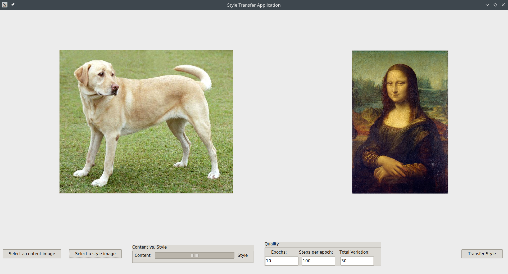

# Our Final Project: Artistic Style Transfer

# Overview

This project is a reimplementation and extention of the paper ["A Neural Algorithm of Artistic Style" by Gatys, Ecker and Bethge](https://arxiv.org/abs/1508.06576)

It allows style transfer from an image onto another image using layers of the VGG19 network.

See the final report of the project [here](https://docs.google.com/document/d/1CKCk7s5dSRnHNVDwWoMsid0bpHmDcsiaxopkc0S3EH0)

This repository includes

- a copy as well as a link to the [colab notebook](https://colab.research.google.com/drive/15S9DsWTqz4iDyIgUqkdvdC2dL321NhOC) we used to reimplement the paper with a detailed explanation of the process

- a small graphical application to easily load your own images and apply the style transfer algorithm to them

## The GUI

Checkout a demo of the workflow on [Loom](https://www.loom.com/share/116e47f5f3004186859b8d067c3d5b28)

### Features

- Select style and content image from your local file system
- Set weights for content vs style
- Select performance parameters for the transfer process
- Save the image to the file system once finished

While we provide a minimal runtime in the `environment.yml` file in this repository, you will get much better performance using your local Tensorflow installation, if you have hardware acceleration set up.

## Example
Here an example of what the training process looks like over time:

# Setup the graphical application

Clone the repository 

`git clone https://github.com/Maxoz99/ANNs-TensorFlow.git`

Change into the `FinalProject/style_transfer` folder

`cd ANNs-Tensorflow/FinalProject/style_transfer`

Create the environment

`conda env create -f environment.yml`

Activate the environment

`conda activate style_transfer_env`

Run the application

`python src/main.py`

# Known Issues

When running the application an Autograph warning might occur related to a packaging issue with a Tensorflow dependency. See [this](https://github.com/tensorflow/tensorflow/issues/44146) issue. It is expected to be fixed in Tensorflow 2.5.0. We encountered that bug only in the conda environment but not with the local Python installation.

# References

- [A Neural Algorithm of Artistic Style" by Gatys, Ecker and Bethge](https://arxiv.org/abs/1508.06576)

- [Neural style transfer](https://www.tensorflow.org/tutorials/generative/style_transfer?hl=en)

- [Neural Style Transfer: Creating Art with Deep Learning using tf.keras and eager execution](https://medium.com/tensorflow/neural-style-transfer-creating-art-with-deep-learning-using-tf-keras-and-eager-execution-7d541ac31398)
